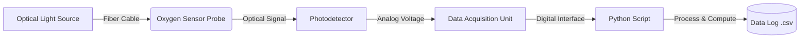
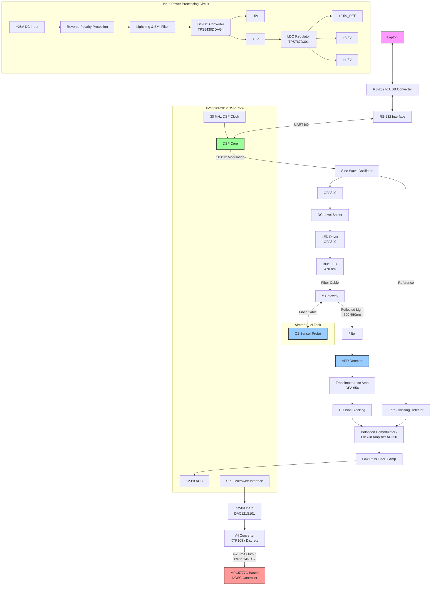

# Fiber-optics-based-oxygen-sensing-system

## Project Overview
This repository contains a Python-based application designed to interface with a fiber-optic oxygen sensing system. It processes optical signal data to measure and log oxygen concentration levels.

## System Block Diagram

## Getting Started
1. Clone this repository.
2. Install the necessary packages.
3. Run the primary Python processing script to begin data collection.

import os
import csv
import time
from datetime import datetime

# =====================================================================
# 1. CORE PARAMETERS & CONSTANTS
# =====================================================================
LOG_DIRECTORY = "data_logs"
LOG_FILE_PATH = os.path.join(LOG_DIRECTORY, "oxygen_sensor_log.csv")

# Constants matching hardware design parameters
MODULATION_FREQUENCY_HZ = 50000.0  # 50 kHz modulation loop
TAU_0 = 100.0                       # Baseline reference lifetime constant

# =====================================================================
# 2. RAW SIGNAL READING INTERFACE
# =====================================================================
def read_hardware_signals():
    """
    Simulates reading from the 12-Bit ADC1/DSP architecture.
    Replace placeholder logic with actual serial/DAQ interface drivers.
    """
    # Simulated phase shift (theta) and signal amplitude readings
    simulated_phase_shift_deg = 45.2
    simulated_amplitude_volts = 2.45
    return simulated_phase_shift_deg, simulated_amplitude_volts

# =====================================================================
# 3. ANALYSIS ALGORITHMS
# =====================================================================
def calculate_oxygen_concentration(phase_shift_deg, amplitude):
    """
    Calculates tau response and Stern-Volmer oxygen concentrations 
    derived from intensity metrics and phase dynamics.
    """
    # Placeholder algorithm representing mathematical hardware matrix
    tau_response = phase_shift_deg / (2 * 3.14159 * MODULATION_FREQUENCY_HZ)
    oxygen_percentage = (TAU_0 / (tau_response + 0.1)) * 0.15  # Scaled example
    
    # Restrict to your target functional aircraft system envelope (1% to 14%)
    oxygen_percentage = max(1.0, min(14.0, oxygen_percentage))
    return tau_response, oxygen_percentage

# =====================================================================
# 4. STORAGE & CSV LOGGING PIPELINE
# =====================================================================
def initialize_storage():
    """Initializes CSV storage layers and checks file header paths."""
    if not os.path.exists(LOG_DIRECTORY):
        os.makedirs(LOG_DIRECTORY)
        
    if not os.path.exists(LOG_FILE_PATH):
        with open(LOG_FILE_PATH, mode='w', newline='') as file:
            writer = csv.writer(file)
            writer.writerow(["Timestamp", "Phase Shift (Deg)", "Amplitude (V)", "Tau Response", "O2 Concentration (%)"])

def log_data_to_file(phase, amp, tau, o2_val):
    """Appends processing snapshots directly into storage streams."""
    current_time = datetime.now().strftime("%Y-%m-%d %H:%M:%S")
    with open(LOG_FILE_PATH, mode='a', newline='') as file:
        writer = csv.writer(file)
        writer.writerow([current_time, f"{phase:.2f}", f"{amp:.3f}", f"{tau:.6f}", f"{o2_val:.2f}"])

# =====================================================================
# 5. CORE EXECUTION ENGINE LOOP
# =====================================================================
def main():
    print("🚀 Initializing Fiber Optics Oxygen Sensing Application Engine...")
    initialize_storage()
    print(f"📁 Active logging storage established at: {LOG_FILE_PATH}")
    
    try:
        while True:
            # Gather raw telemetry metrics
            phase_deg, amp_v = read_hardware_signals()
            
            # Compute analytical matrices
            tau, o2_level = calculate_oxygen_concentration(phase_deg, amp_v)
            
            # Commit record entry snapshot to local disk stream
            log_data_to_file(phase_deg, amp_v, tau, o2_level)
            
            print(f"[{datetime.now().strftime('%H:%M:%S')}] Active Measurement -> O2: {o2_level:.2f}% | Phase: {phase_deg}°")
            
            # Wait for next collection cycle interval step
            time.sleep(1.0)
            
    except KeyboardInterrupt:
        print("\n🛑 Data acquisition terminated safely by system supervisor.")

if __name__ == "__main__":
    main()

numpy>=1.24.0
matplotlib>=3.7.0
pyserial>=3.5
import os
import csv
import time
from datetime import datetime
import serial  # Provided by the 'pyserial' library

# =====================================================================
# 1. CORE PARAMETERS & CONSTANTS
# =====================================================================
LOG_DIRECTORY = "data_logs"
LOG_FILE_PATH = os.path.join(LOG_DIRECTORY, "oxygen_sensor_log.csv")

MODULATION_FREQUENCY_HZ = 50000.0  
TAU_0 = 100.0                       

# 🔌 SERIAL PORT CONFIGURATION
# Windows: Typically 'COM1', 'COM3', 'COM4'
# Mac/Linux: Typically '/dev/ttyUSB0' or '/dev/tty.usbserial-xxx'
SERIAL_PORT = "COM3" 
BAUD_RATE = 9600      # Match the baud rate configured in your DSP UART setup
TIMEOUT_SECONDS = 2   # Prevents script from hanging indefinitely if connection drops

# =====================================================================
# 2. PHYSICAL HARDWARE INTERFACE VIA RS-232
# =====================================================================
def read_hardware_signals(ser):
    """
    Reads active streaming telemetry frames directly from the RS-232 serial connection.
    Assumes your DSP sends a comma-separated string format like: 'phase_value,amplitude_value\n'
    """
    try:
        if ser.in_waiting > 0:
            # Read line from serial buffer, decode bytes to text string, strip whitespace
            raw_line = ser.readline().decode('utf-8', errors='ignore').strip()
            
            # Skip empty lines or malformed frames
            if not raw_line:
                return None, None
                
            # Parse expected telemetry packet tokens (e.g., "45.2,2.45")
            parts = raw_line.split(',')
            if len(parts) == 2:
                phase_shift_deg = float(parts[0])
                simulated_amplitude_volts = float(parts[1])
                return phase_shift_deg, simulated_amplitude_volts
                
    except Exception as e:
        print(f"⚠️ Telemetry processing error: {e}")
        
    return None, None

# =====================================================================
# 3. ANALYSIS ALGORITHMS
# =====================================================================
def calculate_oxygen_concentration(phase_shift_deg, amplitude):
    """Calculates tau response and Stern-Volmer oxygen concentrations."""
    tau_response = phase_shift_deg / (2 * 3.14159 * MODULATION_FREQUENCY_HZ)
    oxygen_percentage = (TAU_0 / (tau_response + 0.1)) * 0.15  
    
    # Target aircraft system validation envelope (1% to 14% Oxygen)
    oxygen_percentage = max(1.0, min(14.0, oxygen_percentage))
    return tau_response, oxygen_percentage

# =====================================================================
# 4. STORAGE & CSV LOGGING PIPELINE
# =====================================================================
def initialize_storage():
    if not os.path.exists(LOG_DIRECTORY):
        os.makedirs(LOG_DIRECTORY)
        
    if not os.path.exists(LOG_FILE_PATH):
        with open(LOG_FILE_PATH, mode='w', newline='') as file:
            writer = csv.writer(file)
            writer.writerow(["Timestamp", "Phase Shift (Deg)", "Amplitude (V)", "Tau Response", "O2 Concentration (%)"])

def log_data_to_file(phase, amp, tau, o2_val):
    current_time = datetime.now().strftime("%Y-%m-%d %H:%M:%S")
    with open(LOG_FILE_PATH, mode='a', newline='') as file:
        writer = csv.writer(file)
        writer.writerow([current_time, f"{phase:.2f}", f"{amp:.3f}", f"{tau:.6f}", f"{o2_val:.2f}"])

# =====================================================================
# 5. CORE EXECUTION ENGINE LOOP
# =====================================================================
def main():
    print("🚀 Initializing Fiber Optics Oxygen Sensing Application Engine...")
    initialize_storage()
    print(f"📁 Active logging storage established at: {LOG_FILE_PATH}")
    
    # Establish live link with the USB-RS232 adapter interface
    try:
        print(f"🔌 Connecting to hardware on interface: {SERIAL_PORT} (Baud: {BAUD_RATE})...")
        ser = serial.Serial(SERIAL_PORT, BAUD_RATE, timeout=TIMEOUT_SECONDS)
        time.sleep(2) # Give the hardware connection port 2 seconds to initialize safely
        print("✅ Serial communications pipe established successfully.")
    except Exception as e:
        print(f"❌ Failed to open port {SERIAL_PORT}. Error: {e}")
        print("💡 Tip: Verify your USB adapter is plugged in and update the SERIAL_PORT string.")
        return

    try:
        while True:
            # Gather live telemetry metrics from physical device
            phase_deg, amp_v = read_hardware_signals(ser)
            
            # Check if valid data frames were captured inside this tick cycle
            if phase_deg is not None and amp_v is not None:
                # Compute analytical matrices
                tau, o2_level = calculate_oxygen_concentration(phase_deg, amp_v)
                
                # Commit record entry snapshot to local disk stream
                log_data_to_file(phase_deg, amp_v, tau, o2_level)
                
                print(f"[{datetime.now().strftime('%H:%M:%S')}] Active Measurement -> O2: {o2_level:.2f}% | Phase: {phase_deg}° | Amp: {amp_v}V")
            
            # Small structural delay to keep hardware reading smoothly
            time.sleep(0.1)
            
    except KeyboardInterrupt:
        print("\n🛑 Data acquisition terminated safely by user command.")
    finally:
        if 'ser' in locals() and ser.is_open:
            ser.close()
            print("🔌 Serial port connection dropped securely.")

if __name__ == "__main__":
    main()
