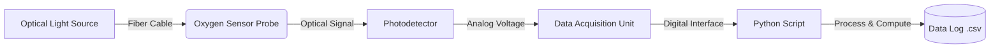

# Fiber-optics-based-oxygen-sensing-system

## Project Overview
This repository contains a Python-based application designed to interface with a fiber-optic oxygen sensing system. It processes optical signal data to measure and log oxygen concentration levels from a serial interface.

## System Block Diagram

## Getting Started
1. Clone this repository to your laptop.
2. Install dependencies: `pip install -r requirements.txt`
3. Run the primary script: `python main.py`
